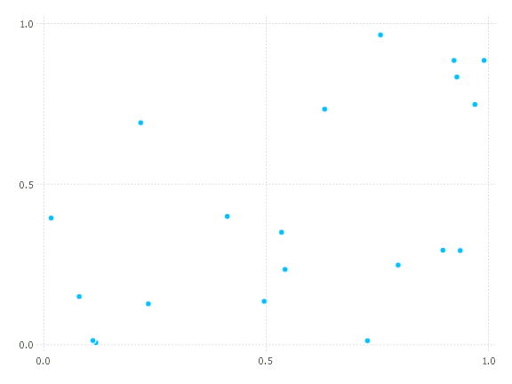
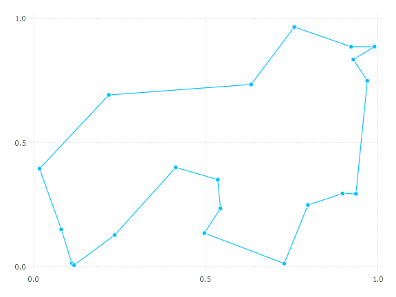
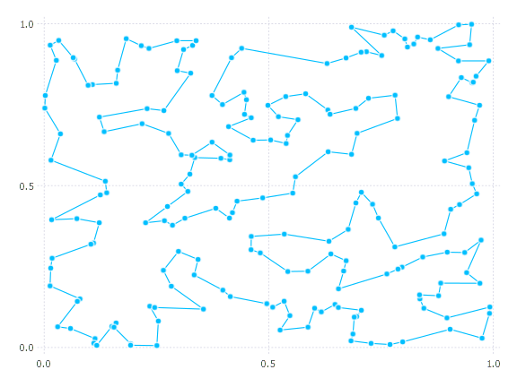
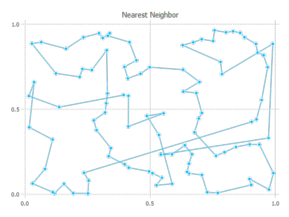
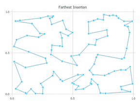
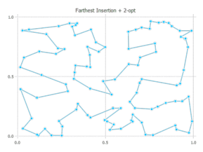
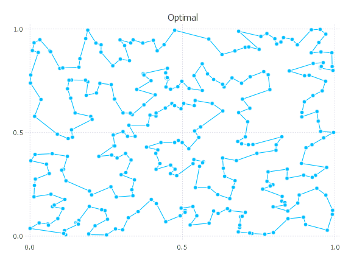
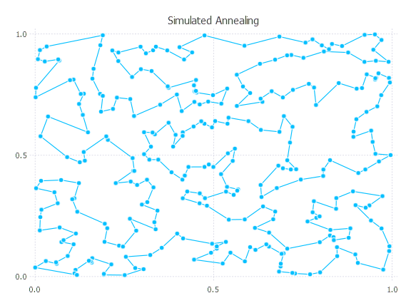

This page gives some examples of using TravelingSalesmanHeuristics. For convenience and so we can easily visualize the problems, we'll use planar Euclidean instances generated as follows:
```
using Random
function generate_instance(n)
	Random.seed!(47)
	pts = rand(2, n)
	distmat = [norm(pts[:,i] - pts[:,j]) for i in 1:n, j in 1:n]
	return pts, distmat
end
```
In this function and throughout the examples, I routinely reseed the global random number generator (with value 47, which is a [great number](http://magazine.pomona.edu/pomoniana/2015/02/13/the-mystery-of-47/)) so that (hopefully) the examples can be reproduced, at least if you're using the same Julia version.

Some handy visualization functions:
```
using Gadfly
plot_instance(pts) = plot(x = pts[1,:], y = pts[2,:], Geom.point, Guide.xlabel(nothing), Guide.ylabel(nothing))
function plot_solution(pts, path, extras = [])
	ptspath = pts[:,path]
	plot(x = ptspath[1,:], y = ptspath[2,:], Geom.point, Geom.path, Guide.xlabel(nothing), Guide.ylabel(nothing), extras...)
end
```

## Basic usage
First, generate and plot a small instance:
```
pts, distmat = generate_instance(20)
plot_instance(pts)
```


A quick solution (run it twice to avoid measuring precompilation):
```
Random.seed!(47)
@time path, cost = solve_tsp(distmat; quality_factor = 5)
      0.000050 seconds (34 allocations: 3.797 KiB)
    ([4, 19, 17, 14, 5, 1, 20, 9, 16, 2  …  6, 10, 15, 11, 18, 8, 12, 13, 3, 4], 3.8300484331007696)
plot_solution(pts, path)
```


It looks like we've found the optimum path, and a higher `quality_factor` doens't give a better objective:
```
Random.seed!(47)
@time path, cost = solve_tsp(distmat; quality_factor = 80)
      0.006352 seconds (92.43 k allocations: 1.551 MiB)
    ([2, 16, 9, 20, 1, 5, 14, 17, 19, 4  …  13, 12, 8, 18, 11, 15, 10, 6, 7, 2], 3.830048433100769)
```
On a bigger instance, the `quality_factor` makes more of a difference:
```
pts, distmat = generate_instance(200)
@time path, cost = solve_tsp(distmat; quality_factor = 5)
      0.008352 seconds (34 allocations: 21.031 KiB)
    ([53, 93, 60, 29, 159, 135, 187, 8, 127, 178  …  11, 10, 154, 59, 80, 6, 108, 188, 57, 53], 10.942110669021305)
@time path, cost = solve_tsp(distmat; quality_factor = 80)
      2.066067 seconds (9.00 M allocations: 177.469 MiB, 2.61% gc time)
    ([20, 27, 76, 23, 92, 146, 161, 194, 152, 171  …  66, 36, 147, 124, 32, 70, 34, 120, 47, 20], 10.552544594904079)
plot_solution(pts, path)
```


Note that increasing `quality_factor` greatly increases the runtime but only slightly improves the objective. This pattern is common.

## Using a specific heuristic
```julia
pts, distmat = generate_instance(100)
path_nn, cost_nn = nearest_neighbor(distmat; firstcity = 1, do2opt = false) # cost is 9.93
path_nn2opt, cost_nn2opt = nearest_neighbor(distmat; firstcity = 1, do2opt = true) # cost is 8.15
path_fi, cost_fi = farthest_insertion(distmat; firstcity = 1, do2opt = false) # cost is 8.12
path_fi2opt, cost_fi2opt = farthest_insertion(distmat; firstcity = 1, do2opt = true) # cost is 8.06
```




## Simulated annealing refinements
The current simulated annealing implementation is very simple (pull requests most welcome!), but it can nonetheless be useful for path refinement. Here's a quick example:
```julia
pts, distmat = generate_instance(300)
path_quick, cost_quick = solve_tsp(distmat)
    ([104, 185, 290, 91, 294, 269, 40, 205, 121, 271  …  156, 237, 97, 288, 137, 63, 257, 168, 14, 104], 13.568672416542647)
path_sa, cost_sa = simulated_annealing(distmat; init_path = Nullable(path_quick), num_starts = 10)
    ([104, 14, 168, 257, 63, 137, 46, 101, 44, 193  …  220, 269, 40, 121, 205, 294, 91, 290, 185, 104], 13.298439981448235)
```

## Lower bounds
In the previous section, we generated a 300 point TSP in the unit square. Is the above solution with cost about `13.3` any good? We can get a rough lower bound:
```
lowerbound(distmat)
    11.5998918075456
```
Let's see where that bound came from:
```
TravelingSalesmanHeuristics.vertwise_bound(distmat)
    8.666013688087942
TravelingSalesmanHeuristics.hkinspired_bound(distmat)
    11.5998918075456
```
Because our problem is symmetric, the latter bound based on spanning trees applies, and this bound is typically tighter.

If we use an integer program to solve the TSP to certified optimality (beyond the scope of this package), we find that the optimal solution has cost about `12.82`. So the final path found by simulated annealing is about `3.7%` worse than the optimal path, and the lower bound reported is about `9.5%` lower than the optimal cost. These values are quite typical for mid-sized Euclidean instances. 

